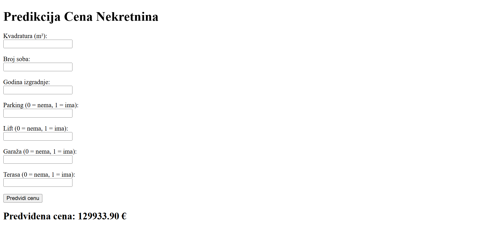

# 🏠 Real Estate Price Prediction

This is a Python application for predicting real estate prices using Machine Learning models such as Random Forest. The application is developed as a Flask web app, allowing users to input property details through a web form and receive a price prediction.

---

## 📸 Application Screenshot



---

## 🚀 How to Run the Application Locally

### 1. Clone the Repository

```bash
git clone https://github.com/plavsic-marko/predikcija-nekretnina.git
cd predikcija-nekretnina
```

### 2. Install Required Libraries

It is recommended to use a virtual environment:

```bash
python -m venv venv
source venv/bin/activate  # For Linux/MacOS
venv\Scripts\activate  # For Windows
```

Then install the required libraries from `requirements.txt`:

```bash
pip install -r requirements.txt
```

### 3. Run the Application

```bash
python main.py
```

The application will be available at:

```
http://localhost:5000
```

---

## 📋 Project Structure

- **main.py**: The main Python file containing the Flask app and Random Forest model.
- **templates/**: Folder containing HTML files for the user interface.
- **Nekretnine_Novi_Sad_Azurirano_v2.xlsx**: The dataset containing real estate data.

---

## 🔧 Required Libraries

- Flask
- pandas
- numpy
- scikit-learn
- openpyxl

Install all the required libraries using the `requirements.txt` file.

---

## 🧪 How to Use the Application

1. Open the application in your browser at `http://localhost:5000`.
2. Enter the property details:
   - Square meters (m²)
   - Number of rooms
   - Year of construction
   - Whether the property has parking, an elevator, a garage, or a terrace (0 = no, 1 = yes)
3. Click the **Predict Price** button, and the application will display the predicted price in euros.

---

## 📊 Used Models

- **Random Forest Regressor**: Used to predict real estate prices.
- Data scaling is performed using **StandardScaler** from scikit-learn.

---

## 📂 Dataset

We use a real estate dataset from Novi Sad, Serbia. The dataset contains the following columns:

- Location
- Square meters (m²)
- Number of rooms
- Year of construction
- Price (€)
- Floor level
- Condition
- Parking
- Proximity to the city center
- Elevator
- Garage
- Terrace

---

## 📌 Note

This application is created for educational purposes and serves as an example of how to use Machine Learning models for real estate price prediction.

---

## 📧 Contact

If you have any questions or suggestions, feel free to contact me via GitHub or email.

Email: plavsicmarko10@gmail.com
GitHub: https://github.com/plavsic-marko

---

**Author: [Marko Plavsic]**
